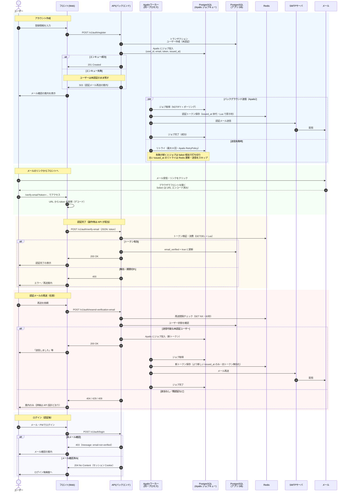

# メール認証フロー

登録からメール確認・ログインまでのシーケンス（Apalis + PostgreSQL ジョブキュー）。

運用 UI: [Apalis Board](https://github.com/apalis-dev/apalis-board) を `http://localhost:3400/` で提供（キュー `verification_email` の監視・再試行状況）。

## シーケンス図

## 旧 Outbox 方式からの変更点

| 項目 | 以前 | 現在 |
|------|------|------|
| キュー | `verification_email_outbox` テーブル + ポーリング | Apalis `PostgresStorage`（`verification_email` キュー） |
| 登録後 | 同一 TX で outbox 行 + `wake_worker` | TX はユーザー INSERT のみ → コミット後に `enqueue`（失敗時は 503・再送で回復） |
| ワーカー | 自前 supervisor・SKIP LOCKED | Apalis ワーカー（NOTIFY・リトライ・グレースフルシャットダウン） |
| 失敗処理 | `attempts` / `failed` 列を手動更新 | Apalis `RetryPolicy`（最大 8 回） |
| 運用 UI | なし | Apalis Board（`/`） |
