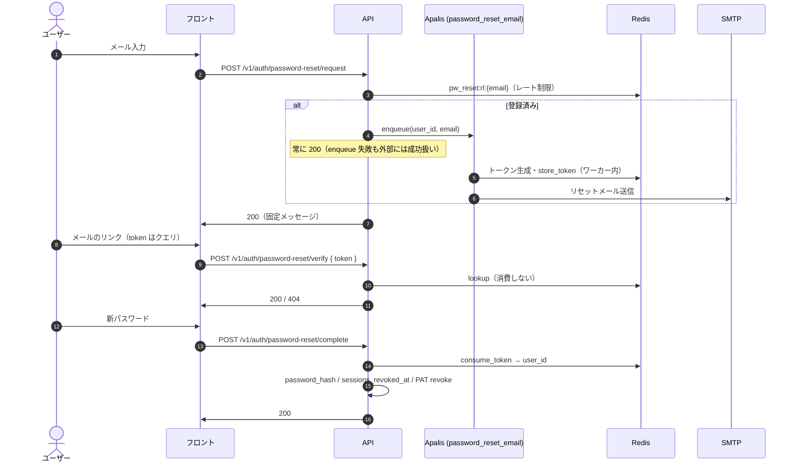

# パスワードリセット・変更フロー（運用）

自己サービスのパスワードリセットとログイン中の変更。仕様の正本は [auth-password-reset](/features/auth-password-reset)（Nuxt Content）。

## 運用 UI

| キュー | Board 登録 | 備考 |
|--------|------------|------|
| `verification_email` | **あり**（`http://localhost:3400/`） | 認証メールの監視・再試行 |
| `password_reset_email` | **なし** | ジョブ payload は `user_id` + `email` のみ。トークンはワーカー内で Redis に保存 |

`password_reset_email` を Board に載せない理由: リセット用 bearer secret を運用 UI・バックアップ・トレースに載せないため（CodeRabbit 指摘対応済み）。

## シーケンス図



## Redis キー

| キー | 内容 | TTL |
|------|------|-----|
| `pw_reset:t:{token}` | `user_id` | 30 分 |
| `pw_reset:u:{user_id}` | `token` | 30 分 |
| `pw_reset:rl:{email}` | `1`（存在のみ） | 60 秒 |

メールアドレスは `normalize_email` 後の値を `rl:` に使用する。

## メールリンクの `?token=` 形式とクライアント側露出

リセットメールのリンクは `{app_url}/password-reset?token={token}`（クエリパラメータ）形式である（`utils/password_reset_delivery.rs` の `build_reset_url`）。

### この形式を採用する理由

| 観点 | 説明 |
|------|------|
| メール UX | クリッカブル URL は通常 GET。クエリ付きリンクはメールクライアント・ブラウザで広くサポートされる |
| フロントルーティング | SPA の `/password-reset` ページが URL から `token` を読み取り、確認 UI を表示する |
| API 設計との分離 | トークン検証・消費は `POST /v1/auth/password-reset/verify` / `complete` の **JSON ボディ**で行い、メールリンク自体はフロント初回ロード用 |

### リスク評価（Low–Medium）

クエリパラメータに bearer トークンを載せるため、次の経路で **クライアント側**に残る可能性がある。

| 経路 | 内容 |
|------|------|
| **ブラウザ履歴** | ユーザーがリンクを踏んだ URL が履歴・同期端末に保存される |
| **`Referer` ヘッダ** | リセットページから外部サイトへ遷移した場合、Referer にフル URL（`?token=` 含む）が載る実装・ブラウザ設定がある |
| **共有端末** | 履歴やオートコンプリートから第三者がトークン付き URL を辿れる |

**サーバー側の緩和**: トークンは TTL 30 分・単回消費（GETDEL）。漏洩しても有効窗口は限定的。

### 現行設計での対策（API アクセスログ非露出）

メールリンクの `?token=` は **フロント初回 GET** にのみ現れる。以降の API 呼び出しは次のとおりトークンをボディで渡す。

```text
GET  /password-reset?token=...     ← フロント（静的/SSR）。バックエンド API ログ対象外
POST /v1/auth/password-reset/verify   { "token": "..." }
POST /v1/auth/password-reset/complete   { "token": "...", "new_password": "..." }
```

そのため **バックエンドのアクセスログ・構造化ログにはリセットトークンを載せない**（下記「構造化ログ」参照）。リクエストログ middleware は `uri.path()` のみ記録し、クエリ文字列は含めない。

> 注意: 上記は API サーバー側の話。ブラウザ履歴・Referer への露出はフロント初回 URL に依存するため、別途下記「将来の検討」を参照。

### 将来の検討事項

より強いクライアント側秘匿が必要になった場合の候補（現時点では未実装・設計メモ）:

| 方式 | 概要 | トレードオフ |
|------|------|--------------|
| **Fragment（`#token=`）** | フラグメントは HTTP リクエストに載らず Referer にも通常含まれない | ルーター・SSR・メールクライアントの `#` 扱い、サーバー側ログ削減の恩恵は「初回ロードがフロントのみ」の前提と同型 |
| **短寿命セッション交換** | メールリンクは opaque `code` のみ。フロントが即 `POST` で one-time token に交換 | 追加エンドポイント・Redis キー設計。メール URL のエントロピーは下げるが交換ステップが増える |

移行時は既存メールの TTL・単回消費・Board 非登録方針を維持し、本ドキュメントと [auth-password-reset](/features/auth-password-reset) §8 を同期更新すること。

## 構造化ログ（トークン非記録）

アプリログに **リセットトークン・新パスワード・メール本文 URL の bearer 部分を出力してはならない**。

| `event` フィールド | タイミング | 付与フィールド |
|-------------------|------------|----------------|
| `auth.password_reset.email_queued` | 登録ユーザーへジョブ投入成功 | `user_id` |
| `auth.password_reset.email_sent` | ワーカーが Redis 保存 + SMTP 成功 | `user_id` |
| `auth.password_reset.completed` | `password-reset/complete` 成功 | `user_id` |
| `auth.password_change.completed` | `password/change` 成功 | `user_id` |

### ログに含めてはいけないもの

- `?token=` クエリ（HTTP アクセスログ・リクエストログで URI 全体を出さない）
- `PasswordResetCompleteBody` の `token` / `new_password`
- Apalis ジョブ payload への平文トークン（禁止・実装済み）
- SMTP 送信失敗時の `Debug` でメール本文全体を出すこと（`error = ?e` のみに留める）

リクエストログ middleware は **パスのみ**（`uri.path()`）を記録し、クエリ文字列は含めない。

### 障害時の監視

| ログ / 条件 | 意味 | 対応 |
|-------------|------|------|
| `password reset email enqueue failed`（`warn!`, `user_id` 付き） | DB 上はユーザー存在するがメールキュー投入失敗 | 外部応答は 200 のまま。キュー・DB 接続を確認し手動再送またはユーザーに時間をおいて再試行を案内 |
| `password reset email worker error` | ワーカー異常終了 | Apalis リトライ（最大 8 回）後の failed を確認 |
| `auth.password_reset.completed` が急増 | 大量リセット完了 | 不正利用・クレデンシャルスタッフィング調査 |

## 関連ドキュメント

- 仕様: `docs/content/2.features/auth-password-reset.md`
- メール認証（同型の Apalis パターン）: [email-verification-flow](./email-verification-flow.md)
- 管理者によるリセット: [admin](/features/admin) §7.1（監査ログ `user.password_reset`）
